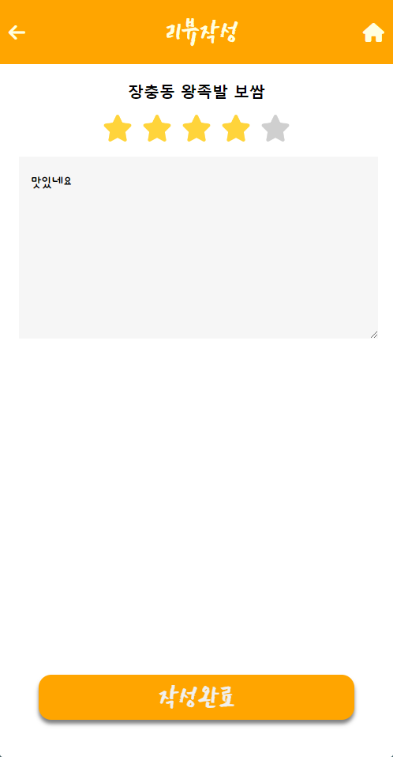

  <h1>전통시장 배달 어플</h1>
   

## 목차

1. [**소개**](#1)
2. [**기술 스택**](#2)
3. [**주요 기능**](#3)
4. [**데모**](#4)
5. [**팀 소개**](#5)
6. [**개발 일정**](#6)
 

## 소개

**전통시장 배달 어플 X 점포용 웹**  
`배달앱`을 통해 전통시장 안에 있는 상품 및 자재들에 대한 배달 요청 및 `점포용 웹`을 통해 요청된 사항들을 처리하고 상품들을 관리하는 서비스.

**문제 정의**  
<li>대형마트, 백화점등 편의성이 좋은 구매처가 생기면서 전통시장이 점점 소외되고 있다.</li>
 

**기대 효과**
<li>전통시장 배달 어플을 통해 전통시장에 대한 접근성을 완화시켜 지역경제를 활성화 시킬수 있다.</li>
 

## 🛠 기술 스택 

### **Front-end**

|  |  |  |
| :----------------------------------------------------------------------------------------------------------------------------: | :--------------------------------------------------------------------------------------------------------------------------: | :-----------------------------------------------------------------------------------------------------------------------------: |
|                                                             HTML5                                                              |                                                             CSS3                                                             |                                                         JavaScript(ES6)                                                         |

### **Back-end**

|  |  |
| :----------------------------------------------------------------------------------------------------------------------------: | :----------------------------------------------------------------------------------------------------------------------------: |
|                                                           Node.js                                                              |                                                           firebase                                                             |
 

## ⚙️ 주요 기능

### **배달 어플**

|       기능        |                 
내용
                                               |
| :---------------: | :------------------------------------------------------------------------------------------- |
| 로그인 & 회원가입  | 이용시장, 주소설정 등 정보를 기입하여 회원가입하고 로그인하여 어플을 이용할 수 있다. |
| 마이페이지  | 주소, 이용시장 등 자신의 정보를 업데이트 할 수 있다. |
| 배달현황 | 자신이 배달시킨 상품에 대한 배달현황을 보여준다. |
| 구매내역 | 자신이 배달시킨 상품 중 배달이 완료된 상품들을 보여준다. |
| 리뷰작성 & 작성한 리뷰 | 가게에 리뷰를 남길 수 있고 자신이 작성한 리뷰를 확인할 수 있다. |
| 주문하기 | 원하는 상품의 수량을 선택후 배달을 요청 할 수 있다. |

### **점포 웹**

|       기능        |                 
내용
                                               |
| :---------------: | :------------------------------------------------------------------------------------------- |
| 로그인 & 회원가입  | 시장, 점포명 등 정보를 기입하여 회원가입하고 로그인하여 웹을 이용할 수 있다. |
| 마이페이지  | 대표 이미지, 배달 팁 등 점포의 정보를 업데이트 할 수 있다. |
| 상품등록 | 상품의 사진, 상품의 이름 등 상품의 정보를 기입하여 등록할 수 있다. |
| 주문받기 | 주문자의 배달요청을 접수할 수 있다. |
 

## 🖥️ 데모

### **배달 어플**

  
|                          메인 화면                          |                          로그인                          |                          회원가입                          |
| :-----------------------------------------------------------: | :-----------------------------------------------------------: | :-----------------------------------------------------------: |
|  |  |  |

|                          메뉴 화면                          |                          마이페이지                          |                          주문하기                          |
| :-----------------------------------------------------------: | :-----------------------------------------------------------: | :-----------------------------------------------------------: |
|  |  |  |

|                          리뷰 페이지                          |                          리뷰작성                          |                          작성한 리뷰                          |
| :-----------------------------------------------------------: | :-----------------------------------------------------------: | :-----------------------------------------------------------: |
|  |  |  |

|                          배달현황                          |                          구매내역                          |
| :-----------------------------------------------------------: | :-----------------------------------------------------------: |
|  |  |

### **점포 웹**

|                          로그인                          |
| :-----------------------------------------------------------: |
|  |

|                          회원가입                          |
| :-----------------------------------------------------------: |
|  |

|                          메인 화면                          |
| :-----------------------------------------------------------: |
|  |

|                          마이페이지                          |
| :-----------------------------------------------------------: |
|  |

|                          상품등록                          |
| :-----------------------------------------------------------: |
|  |

|                          배달요청                          |
| :-----------------------------------------------------------: |
|  |

|                          접수완료                          |
| :-----------------------------------------------------------: |
|  |

|                          배달중                          |
| :-----------------------------------------------------------: |
|  |

|                          배달완료                          |
| :-----------------------------------------------------------: |
|  |
 

## 🏢 팀 소개

<table>
  <tr>
    <td align="center">
      
    </td>
    <td align="center">
      
    </td>
    <td align="center">
      
    </td>
    <td align="center">
      
    </td>
  </tr>
  <tr>
    <td align="center">
      <a href="https://github.com/Ming0099">
        김민곤 (Back-end)
      </a>
    </td>
    <td align="center">
      <a href="https://github.com/kim-1210">
        김대영 (Front-end)
      </a>
    </td>
    <td align="center">
      <a href="https://github.com/ChristMasXs">
        김관태 (Front-end)
      </a>
    </td>
    <td align="center">
      <a href="https://github.com/Ppemppu">
        류영진 (Front-end)
      </a>
    </td>
  </tr>
</table>
 

## 📅 개발일정

### 개발 기간

24.01.29 ~ 24.02.28 (5주)

### 개발 일정

| 주차  |                                               내용                                                |
| :---: | :-----------------------------------------------------------------------------------------------: |
| 1주차 | 어플리케이션 UI 설계 및 개발 웹 UI 설계 및 개발 |
| 2주차 | 로그인 개발 회원가입 개발 웹 상품등록 기능 개발  |
| 3주차 | 사용자 마이페이지 개발 웹 마이페이지 개발 주문하기 기능 개발  |
| 4주차 | 리뷰 페이지 개발 리뷰 작성 페이지 개발 리뷰 작성 기능 개발  |
| 5주차 | 배달현황 페이지 개발 구매내역 페이지 개발 작성한 리뷰 페이지 개발 웹 배달현황 전환 기능 개발 |
